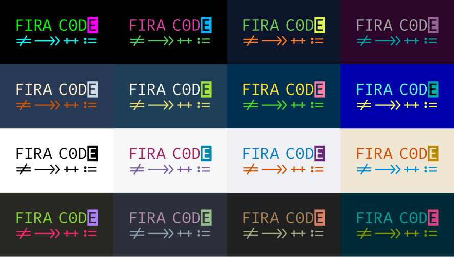
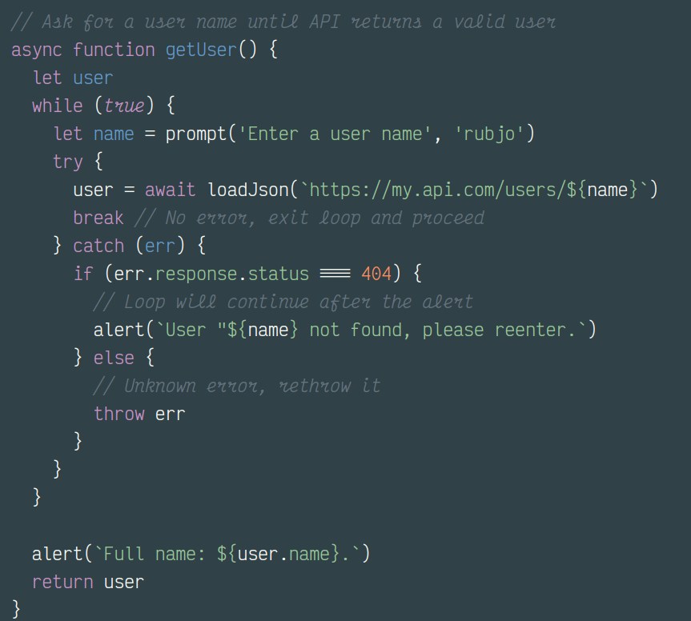

Photo by Jasper Boer on Unsplash

#### Introduction

Knowing your way around the terminal can make you much more productive as a programmer.
As well as using essential tools for development such as Git and NPM/Yarn, there
are many more commands that can speed up your workflow, especially when you can
start making scripts to automate frequent or time-consuming tasks. This year I
decided to make a concious effort to get more proficient at using the command line,
which means I've been spending a lot more time in my terminal.

I took a look around in the wild for different terminals that I would be able to
customise to my liking. Mainly I wanted to have a nice looking color theme
and fonts, especially for programming.

I first stumbled across a terminal called [Alacritty](https://github.com/alacritty/alacritty)
which I thought was cool since it's a GPU-accelerated terminal editor. It touts that
it's the fastest terminal emulator in existence.

I used Alacritty for a few months, and while it sacrifices a lot of features that
other terminals have, when combined with something like Tmux, you still get nice
window/tab management to run multiple terminals at the same time. The thing that
got me though was that I couldn't get italic fonts to render properly, and I really
wanted to use a font style like [Wes Bos](https://wesbos.com/uses/), especially
since all my programming is done in the terminal now too.

#### Kitty Terminal

I then found another GPU based terminal emulator called [Kitty](https://sw.kovidgoyal.net/kitty/).
It has a lot more modern features like OpenType ligatures, which look awesome in
programming languages like JavaScript. A common programming font that uses ligatures
is Fira Code


What font ligatures look like in Fira Code

And also supports tiling multiple terminal windows side by side in different layouts
without needing to use Tmux.

#### Installation

Getting started with Kitty was pretty easy if you're using Ubuntu, just follow these steps:
_(If you're not on Ubuntu, Kitty is cross-platform too so you should be able to
find the equivalent installation method for your operating system online.)_

1. Open your current terminal app and type the the following command to download
the installer

```bash
curl -L https://sw.kovidgoyal.net/kitty/installer.sh | sh /dev/stdin
```

This will install the latest version of Kitty into the `~/.local/kitty.app/bin/kitty`
location.

Now, to integrate with your desktop, so the app shows up in your list of apps do
following:

1. `ln -s ~/.local/kitty.app/bin/kitty ~/.local/bin/`

2. `cp ~/.local/kitty.app/share/applications/kitty.desktop ~/.local/share/applications`

3. `~/.local/share/applications/kitty.desktop`

Done. You should now see kitty in your apps.

#### Configuration

One thing that was real important for me was installing a nice font that would
be nice to look at all day while I was programming.

Kitty makes it really easy to customize your font, and the font management
is super powerful. You can select individual fonts for regular, bold, italic and
bold italic. Simply create a new file in `~/.config/kitty/kitty.conf` and add
the following lines along with any font you like. You can see a list of all your
installed fonts by opening Font Manager.

```
font_family      Operator Mono Book
bold_font        Operator Mono Medium
italic_font      Operator Mono Book Italic
bold_italic_font Operator Mono Medium Italic
```

Operator Mono is a nice looking font, it's the one Wes Bos uses - but he paid
$200 for it and I wasn't about to fork out that much money for a font. I found
a font called [Victor Mono](https://rubjo.github.io/victor-mono/) that looks
somewhat similar with the semi-connected cursive italics, and programming symbol
ligatures (which Kitty supports).


An example of Victor Mono font

You can get it by following these steps:

```
1. [Download](https://rubjo.github.io/victor-mono/VictorMonoAll.zip) the font
2. Unpack the ZIP
3. Install the font by adding into the Font Manager application
4. Update your Kitty `kitty.config` file
```

My current `kitty.config` file looks like this:

```
font_family		Victor Mono Light
bold_font		Victor Mono Bold
italic_font		Victor Mono Italic
bold_italic_font	Victor Mono Bold Italic
adjust_column_width	120%
```

#### Conclusion

While writing this blog post I honestly wondered why I even switched
terminals, was it just so I could pretend I was cool with a fancy new
terminal? The terminal that ships with Ubuntu is pretty great too, but
I think even just having support for ligatures and window management
features makes it worth while for me.

I've only been using Kitty for a few days but it's working out pretty
great so far!

Happy Coding!
